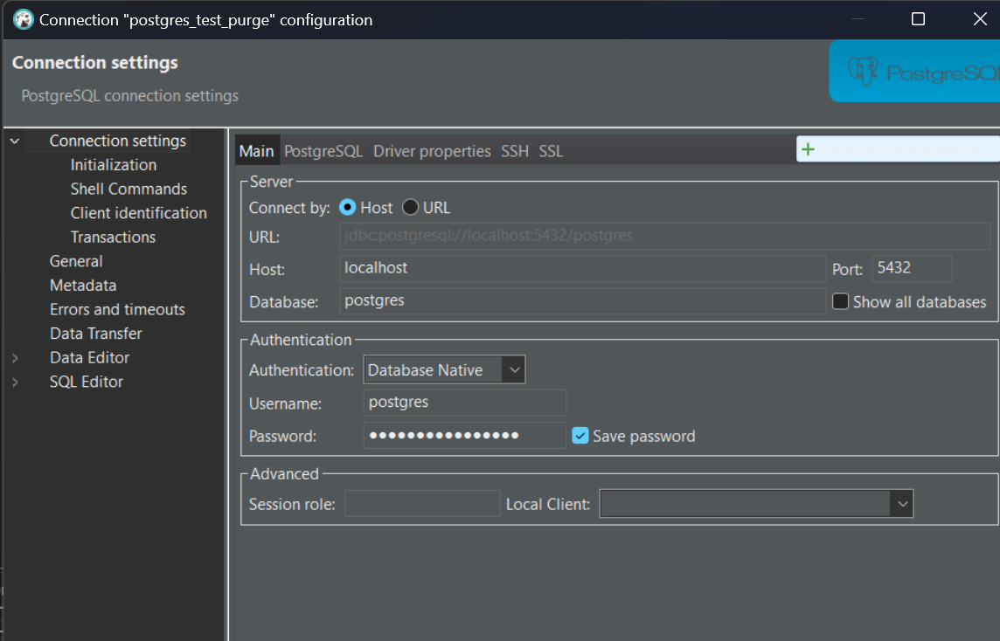

## what I want to do 

I want to test storing data in multiple partitions in Postgres. For example, a master partition and a purge partition. For data that is no longer needed, modify its state column so that the data is automatically migrated to the purge partition.  
I want to test the following aspects:

## run postgres-sql in docker 
create the docker-compose.yml, the data file is externalized. 
```
volumes:
      - C:\yao\myWorkspace\docker\postgres_test_purge\postgres_data:/var/lib/postgresql/data
```
run it
```
docker-compose up
```
Now the database is up and running 

## connect postgres db from dbeaver


## download big data for performance testing 
dataset is downloaded from here https://www.datablist.com/learn/csv/download-sample-csv-files  
I choosed the customers-2000000.csv. The file is saved in source_data folder. 

## create the table
```
CREATE TABLE public.customer_data (
    index SERIAL PRIMARY KEY,
    customer_id VARCHAR(20),
    first_name VARCHAR(50),
    last_name VARCHAR(50),
    company VARCHAR(100),
    city VARCHAR(100),
    country VARCHAR(100),
    phone_1 VARCHAR(30),
    phone_2 VARCHAR(30),
    email VARCHAR(100),
    subscription_date DATE,
    website VARCHAR(255)
);
```

## load the data into postgres 
copy the file into the folder ```C:\yao\myWorkspace\docker\postgres_test_purge\postgres_data```
as this folder is mounted to the server, the copy command below can only access the file on the server.
```
COPY public.customer_data(index, customer_id, first_name, last_name, company, city, country, phone_1, phone_2, email, subscription_date, website)
FROM '/var/lib/postgresql/data/customers-2000000.csv'
DELIMITER ','
CSV HEADER;
```

## create the default, expired and purge partition 
```
-- Step 1: Alter Table for Partitioning
ALTER TABLE public.customer_data RENAME TO customer_data_old;

CREATE TABLE public.customer_data (
    id SERIAL,
    customer_id VARCHAR(20),
    first_name VARCHAR(50),
    last_name VARCHAR(50),
    company VARCHAR(100),
    city VARCHAR(100),
    country VARCHAR(100),
    phone_1 VARCHAR(30),
    phone_2 VARCHAR(30),
    email VARCHAR(100),
    subscription_date DATE,
    website VARCHAR(255),
    state VARCHAR(10) DEFAULT 'active',
    PRIMARY KEY (id, state)
) PARTITION BY LIST (state);
```
In PostgreSQL, when you are using table partitioning, the primary key must include all partitioning columns. However, if you want to enforce a primary key on the id column alone in the context of a partitioned table, PostgreSQL does not allow this directly because it requires global uniqueness across all partitions.

*** I don't like this, as primary key shall not be updatable after creating. But the state column is updatable. ***

Add partitions for expired, purge and default. 
```
CREATE TABLE public.customer_data_expired PARTITION OF public.customer_data
FOR VALUES IN ('expired');

CREATE TABLE public.customer_data_purge PARTITION OF public.customer_data
FOR VALUES IN ('purge');

CREATE TABLE public.customer_data_default PARTITION OF public.customer_data
DEFAULT;
```

```
-- Step 2: Transfer Data
INSERT INTO public.customer_data (id, customer_id, first_name, last_name, company, city, country, phone_1, phone_2, email, subscription_date, website)
SELECT index, customer_id, first_name, last_name, company, city, country, phone_1, phone_2, email, subscription_date, website 
FROM public.customer_data_old;

DROP TABLE public.customer_data_old;

-- Step 3: verify 
select count(*) from customer_data_default
-- you can see all 2 million records are in default partition as their states are all active by default. 

update customer_data set state='expired' where id=1;
select count(*) from customer_data_expired cde;
-- now you can see the first record is moved to the "expired" partition

update customer_data set state='purge' where id=2;
select count(*) from customer_data_purge cdp;
-- now the record 2 is moved to partition "purge".

```
